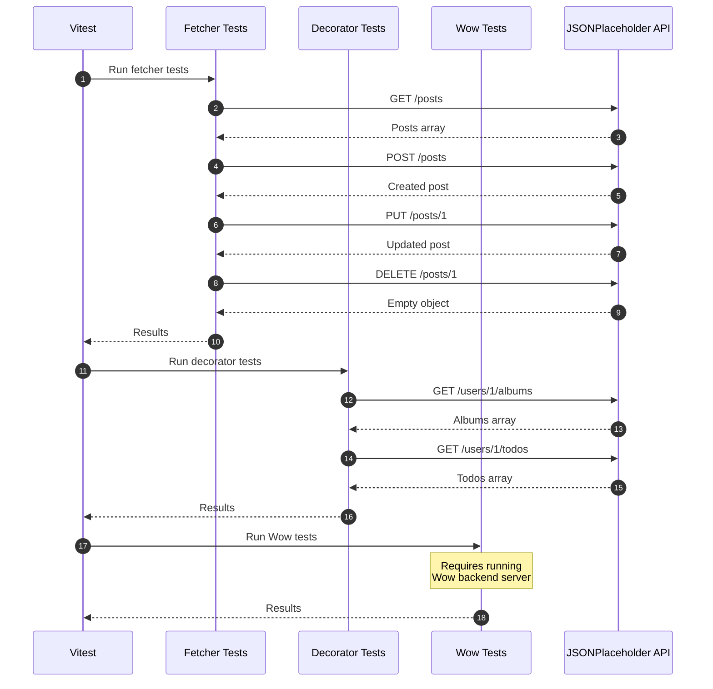
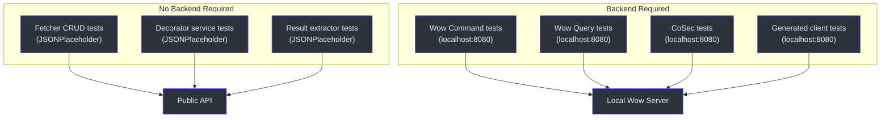
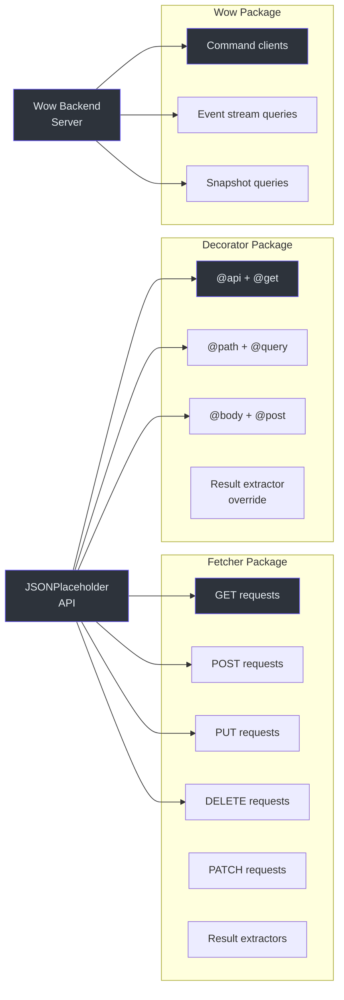

# 集成测试

集成测试验证 Fetcher 生态系统在真实 HTTP API 下是否能正常工作。`integration-test` 工作区包含对公共 API 和运行中的后端服务发起实际网络调用的测试。

## 工作区结构

```
integration-test/
  src/
    fetcher/
      typicodeFetcher.ts          # 用于 JSONPlaceholder 的 NamedFetcher
    decorator/
      typicodeUserService.ts      # 基于装饰器的 API 客户端
      typicodePostService.ts
      resultExtractorService.ts
    wow/
      cart/
        cartCommandClient.ts      # CQRS 命令客户端
        cartClientOptions.ts
      exampleFetcher.ts
    generated/
      example/                    # 从 OpenAPI 规范自动生成
  test/
    fetcher/
      typicodeFetcher.test.ts     # Fetcher 集成测试
    decorator/
      typicodeUserService.test.ts # Decorator 集成测试
      typicodePostService.test.ts
      resultExtractorService.test.ts
    wow/
      cart/
        cartCommandClient.test.ts
    openai/
      openai.test.ts
```

**源码:** [`integration-test/`](https://github.com/Ahoo-Wang/fetcher/blob/main/integration-test)

## 测试 API：JSONPlaceholder

集成测试使用的主要测试 API 是 [JSONPlaceholder](https://jsonplaceholder.typicode.com)，一个免费的公共 REST API。它提供了无需认证的真实 CRUD 端点。

### Fetcher 设置

```typescript
import { NamedFetcher } from '@ahoo-wang/fetcher';

export const typicodeFetcher = new NamedFetcher('typicode', {
  baseURL: 'https://jsonplaceholder.typicode.com',
});

// 可选：添加拦截器
typicodeFetcher.interceptors.request.use(cosecRequestInterceptor);
typicodeFetcher.interceptors.response.use(authorizationResponseInterceptor);
```

**源码:** [`integration-test/src/fetcher/typicodeFetcher.ts`](https://github.com/Ahoo-Wang/fetcher/blob/main/integration-test/src/fetcher/typicodeFetcher.ts)

## 集成测试示例

### Fetcher 级别测试

直接使用 Fetcher 类对 JSONPlaceholder 进行的测试：

```typescript
import { describe, it, expect } from 'vitest';
import { typicodeFetcher } from '../../src';
import { HttpMethod, ResultExtractors } from '@ahoo-wang/fetcher';

describe('typicodeFetcher Integration Test', () => {
  it('should fetch posts from typicode API', async () => {
    const response = await typicodeFetcher.get('/posts');
    expect(response).toBeDefined();
    const posts = await response.json();
    expect(Array.isArray(posts)).toBe(true);
    expect(posts.length).toBeGreaterThan(0);

    const post = posts[0];
    expect(post).toHaveProperty('id');
    expect(post).toHaveProperty('userId');
    expect(post).toHaveProperty('title');
    expect(post).toHaveProperty('body');
  });

  it('should create a new post', async () => {
    const newPost = { userId: 1, title: 'Test Post', body: 'Content' };
    const response = await typicodeFetcher.post('/posts', {
      body: JSON.stringify(newPost),
    });
    const post = await response.json();
    expect(post).toHaveProperty('id');
    expect(post.title).toBe(newPost.title);
  });

  it('should update a post', async () => {
    const response = await typicodeFetcher.put('/posts/1', {
      body: { userId: 1, title: 'Updated', body: 'Updated content' },
    });
    const post = await response.json();
    expect(post.title).toBe('Updated');
  });

  it('should delete a post', async () => {
    const response = await typicodeFetcher.delete('/posts/1');
    const result = await response.json();
    expect(result).toEqual({});
  });
});
```

**源码:** [`integration-test/test/fetcher/typicodeFetcher.test.ts`](https://github.com/Ahoo-Wang/fetcher/blob/main/integration-test/test/fetcher/typicodeFetcher.test.ts)

### Decorator 级别测试

使用基于装饰器的 API 服务进行的测试：

```typescript
import { describe, it, expect } from 'vitest';
import { typicodeUserService } from '../../src';

describe('TypicodeUserService Integration Test', () => {
  it('should get user albums', async () => {
    const albums = await typicodeUserService.getAlbums('1');
    expect(albums).toBeDefined();
    expect(Array.isArray(albums)).toBe(true);
    if (albums.length > 0) {
      expect(albums[0]).toHaveProperty('id');
      expect(albums[0]).toHaveProperty('userId');
      expect(albums[0]).toHaveProperty('title');
    }
  });

  it('should get user todos', async () => {
    const todos = await typicodeUserService.getTodos('1');
    expect(todos).toBeDefined();
    expect(Array.isArray(todos)).toBe(true);
  });

  it('should get user posts', async () => {
    const posts = await typicodeUserService.getPosts('1');
    expect(posts).toBeDefined();
    expect(Array.isArray(posts)).toBe(true);
  });
});
```

**源码:** [`integration-test/test/decorator/typicodeUserService.test.ts`](https://github.com/Ahoo-Wang/fetcher/blob/main/integration-test/test/decorator/typicodeUserService.test.ts)

## 测试执行流程



## 环境配置

### 包配置

```json
{
  "scripts": {
    "test": "vitest run --coverage",
    "generate": "pnpm exec fetcher-generator generate -i http://localhost:8080/v3/api-docs"
  }
}
```

**源码:** [`integration-test/package.json`](https://github.com/Ahoo-Wang/fetcher/blob/main/integration-test/package.json)

### Vite 配置

```typescript
// integration-test/vite.config.ts
export default defineConfig({
  build: {
    lib: {
      entry: 'src/index.ts',
      name: 'FetcherIt',
      fileName: format => `index.${format}.js`,
    },
    rollupOptions: {
      external: [
        '@ahoo-wang/fetcher',
        '@ahoo-wang/fetcher-decorator',
        '@ahoo-wang/fetcher-eventstream',
        '@ahoo-wang/fetcher-cosec',
        '@ahoo-wang/fetcher-wow',
      ],
    },
  },
});
```

**源码:** [`integration-test/vite.config.ts`](https://github.com/Ahoo-Wang/fetcher/blob/main/integration-test/vite.config.ts)

## 运行集成测试

```bash
# 从根目录
pnpm test:it

# 从 integration-test 目录
cd integration-test && pnpm test

# 特定测试文件
pnpm --filter @ahoo-wang/fetcher-integration-test vitest run test/fetcher/typicodeFetcher.test.ts
```

## 集成测试分类



## Wow CQRS 集成测试

Wow 集成测试针对运行中的 Wow 后端验证命令/事件溯源模式：

- **CartCommandClient**：发送命令（AddCartItem、RemoveCartItem、ChangeQuantity）
- **EventStreamQueryClient**：通过 SSE 查询事件流
- **SnapshotQueryClient**：查询聚合快照
- **生成的客户端**：测试从 OpenAPI 规范自动生成的代码

这些测试需要在 `localhost:8080` 上运行后端服务器，通常在 CI 中除非服务器可用，否则会被跳过。

## 集成测试覆盖范围



## 相关页面

- [测试概览](./index.md) -- 测试策略概览
- [单元测试](./unit-testing.md) -- 单元测试指南
- [浏览器测试](./browser-testing.md) -- 浏览器和组件测试
- [Fetcher 客户端 API](../api/fetcher-client.md) -- 被测试的 API
