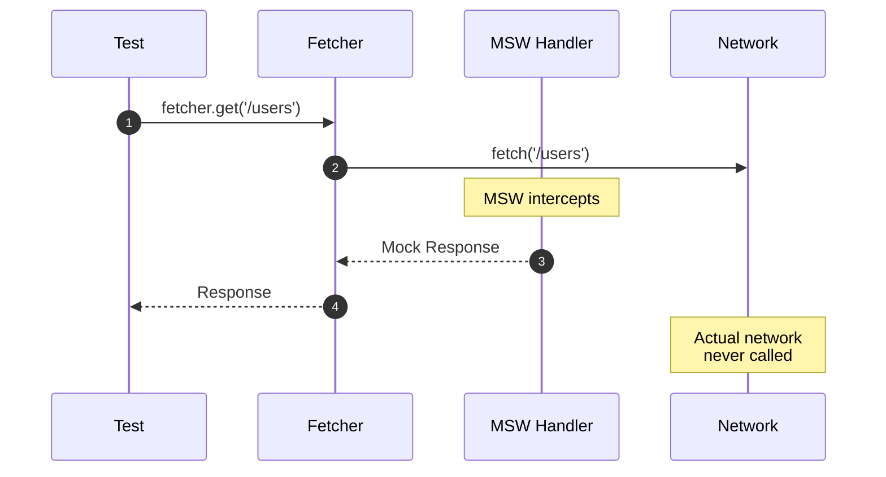
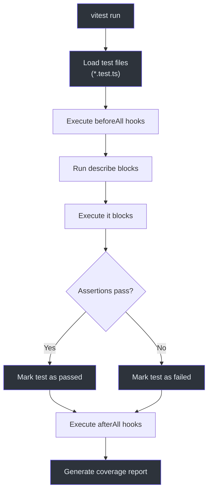
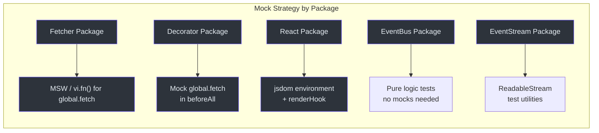

# 单元测试

单元测试是 Fetcher 测试策略的基础。每个包都有一套使用 Vitest 的全面测试套件。本页涵盖 monorepo 中使用的工具、模式和示例。

## Vitest 配置

所有包都使用启用了全局模式的 Vitest。这意味着 `describe`、`it`、`expect` 和 `vi` 无需显式导入即可使用（不过为了清晰起见，实践中仍会使用导入）。

```typescript
// 示例：packages/viewer/vitest.config.ts
import { configDefaults, defineConfig, mergeConfig } from 'vitest/config';
import viteConfig from './vite.config';

export default mergeConfig(
  viteConfig,
  defineConfig({
    test: {
      environment: 'jsdom',
      globals: true,
      setupFiles: ['./test/setup.ts'],
      coverage: {
        exclude: [...configDefaults.exclude, '**/**.stories.tsx'],
      },
    },
  }),
);
```

**源码:** [`packages/viewer/vitest.config.ts`](https://github.com/Ahoo-Wang/fetcher/blob/main/packages/viewer/vitest.config.ts)

## 测试文件位置

测试位于包根目录的 `test/` 目录中：

```
packages/fetcher/
  test/
    fetcher.test.ts
    fetcherError.test.ts
    interceptor.test.ts
    interceptorManager.test.ts
    urlBuilder.test.ts
    ...
packages/decorator/
  test/
    apiDecorator.test.ts
    endpointDecorator.test.ts
    parameterDecorator.test.ts
    ...
```

## MSW HTTP 模拟（Fetcher 包）

fetcher 包使用 MSW（Mock Service Worker）在网络层面拦截和模拟 HTTP 请求。

### MSW 工作原理



### Mock Service Worker 模式

对于不使用 MSW 的包，标准做法是直接模拟 `global.fetch`：

```typescript
import { describe, it, expect, vi, beforeAll, afterAll } from 'vitest';

const originalFetch = global.fetch;
beforeAll(() => {
  global.fetch = vi.fn(() =>
    Promise.resolve({
      ok: true,
      status: 200,
      json: () => Promise.resolve({ mocked: 'response' }),
      text: () => Promise.resolve('mocked response'),
    } as Response),
  );
});

afterAll(() => {
  global.fetch = originalFetch;
});
```

**源码:** [`packages/decorator/test/apiDecorator.test.ts:18`](https://github.com/Ahoo-Wang/fetcher/blob/main/packages/decorator/test/apiDecorator.test.ts#L18)

## 测试 Fetcher 类

Fetcher 类可以通过模拟拦截器管道来测试：

```typescript
import { describe, it, expect, vi } from 'vitest';
import { Fetcher, HttpMethod } from '@ahoo-wang/fetcher';

describe('Fetcher', () => {
  it('should create with default options', () => {
    const fetcher = new Fetcher();
    expect(fetcher.urlBuilder.baseURL).toBe('');
    expect(fetcher.headers).toEqual({ 'Content-Type': 'application/json' });
    expect(fetcher.timeout).toBeUndefined();
  });

  it('should make GET request', async () => {
    const fetcher = new Fetcher();
    const mockResponse = new Response('test');

    // 模拟 interceptors.exchange 方法
    const exchangeSpy = vi
      .spyOn(fetcher.interceptors, 'exchange')
      .mockImplementation(async exchange => {
        exchange.response = mockResponse;
        return exchange;
      });

    const response = await fetcher.get('/users');
    expect(response).toBe(mockResponse);
    expect(exchangeSpy).toHaveBeenCalled();
  });

  it('should make POST request with body', async () => {
    const fetcher = new Fetcher();
    const exchangeSpy = vi
      .spyOn(fetcher.interceptors, 'exchange')
      .mockImplementation(async exchange => {
        exchange.response = new Response('{}');
        return exchange;
      });

    await fetcher.post('/users', {
      body: { name: 'John' },
    });

    expect(exchangeSpy).toHaveBeenCalled();
  });
});
```

**源码:** [`packages/fetcher/test/fetcher.test.ts`](https://github.com/Ahoo-Wang/fetcher/blob/main/packages/fetcher/test/fetcher.test.ts)

## 测试拦截器

拦截器通过独立创建并验证其正确修改 exchange 来进行测试：

```typescript
import { describe, it, expect } from 'vitest';
import { ValidateStatusInterceptor } from '@ahoo-wang/fetcher';

describe('ValidateStatusInterceptor', () => {
  it('should pass for 2xx status', () => {
    const interceptor = new ValidateStatusInterceptor();
    const exchange = createMockExchange({ status: 200 });
    expect(() => interceptor.intercept(exchange)).not.toThrow();
  });

  it('should throw for non-2xx status', () => {
    const interceptor = new ValidateStatusInterceptor();
    const exchange = createMockExchange({ status: 404 });
    expect(() => interceptor.intercept(exchange)).toThrow();
  });

  it('should use custom validateStatus', () => {
    const interceptor = new ValidateStatusInterceptor(
      (status) => status === 200
    );
    const exchange = createMockExchange({ status: 201 });
    expect(() => interceptor.intercept(exchange)).toThrow();
  });
});
```

**源码:** [`packages/fetcher/test/validateStatusInterceptor.test.ts`](https://github.com/Ahoo-Wang/fetcher/blob/main/packages/fetcher/test/validateStatusInterceptor.test.ts)

## 测试装饰器

装饰器测试验证元数据存储、方法替换和参数绑定：

```typescript
import { describe, it, expect, vi, beforeAll, afterAll } from 'vitest';
import 'reflect-metadata';
import { api, API_METADATA_KEY, endpoint, parameter, ParameterType } from '@ahoo-wang/fetcher-decorator';
import { autoGeneratedError, HttpMethod, JsonResultExtractor } from '@ahoo-wang/fetcher-decorator';

// 模拟 fetch
const originalFetch = global.fetch;
beforeAll(() => {
  global.fetch = vi.fn(() =>
    Promise.resolve({
      ok: true,
      status: 200,
      json: () => Promise.resolve({ mocked: true }),
    } as Response),
  );
});
afterAll(() => { global.fetch = originalFetch; });

@api('/api/v1', {
  headers: { 'X-Default': 'value' },
  timeout: 3000,
  resultExtractor: JsonResultExtractor,
})
class TestApi {
  @endpoint(HttpMethod.GET, '/users')
  getUsers() { throw autoGeneratedError(); }

  @endpoint(HttpMethod.GET, '/users/{id}')
  getUser(@parameter(ParameterType.PATH, 'id') id: string) { throw autoGeneratedError(); }

  notDecoratedMethod() { return 'not decorated'; }
}

describe('apiDecorator', () => {
  it('should store API metadata', () => {
    const metadata = Reflect.getMetadata(API_METADATA_KEY, TestApi);
    expect(metadata.basePath).toBe('/api/v1');
    expect(metadata.headers).toEqual({ 'X-Default': 'value' });
    expect(metadata.timeout).toBe(3000);
  });

  it('should replace decorated methods with functions', () => {
    const api = new TestApi();
    expect(typeof api.getUsers).toBe('function');
    expect(api.getUsers()).toBeInstanceOf(Promise);
  });

  it('should preserve non-decorated methods', () => {
    const api = new TestApi();
    expect(api.notDecoratedMethod()).toBe('not decorated');
  });

  it('should support inheritance', () => {
    @api('/child')
    class ChildApi extends TestApi {
      @endpoint(HttpMethod.POST, '/child-endpoint')
      childMethod() { throw autoGeneratedError(); }
    }
    const childApi = new ChildApi();
    expect(typeof childApi.getUsers).toBe('function');
    expect(typeof childApi.childMethod).toBe('function');
  });
});
```

**源码:** [`packages/decorator/test/apiDecorator.test.ts`](https://github.com/Ahoo-Wang/fetcher/blob/main/packages/decorator/test/apiDecorator.test.ts)

## 测试错误类

```typescript
import { describe, it, expect } from 'vitest';
import { FetcherError, ExchangeError } from '@ahoo-wang/fetcher';

describe('FetcherError', () => {
  it('should create with message', () => {
    const error = new FetcherError('test error');
    expect(error.message).toBe('test error');
    expect(error.name).toBe('FetcherError');
  });

  it('should support cause chaining', () => {
    const cause = new Error('root cause');
    const error = new FetcherError(undefined, cause);
    expect(error.message).toBe('root cause');
    expect(error.cause).toBe(cause);
  });

  it('should work with instanceof', () => {
    const error = new FetcherError();
    expect(error).toBeInstanceOf(Error);
    expect(error).toBeInstanceOf(FetcherError);
  });
});
```

**源码:** [`packages/fetcher/test/fetcherError.test.ts`](https://github.com/Ahoo-Wang/fetcher/blob/main/packages/fetcher/test/fetcherError.test.ts)

## 测试执行流程



## 按包分类的测试

| 包 | 测试数量 | 重点测试领域 |
|---------|-----------|----------------|
| fetcher | 21 个测试文件 | Fetcher、拦截器、URL 构建器、错误、注册器、超时 |
| decorator | 7 个测试文件 | API 装饰器、端点装饰器、参数装饰器、元数据、执行器 |
| eventbus | 5 个测试文件 | EventBus、并行/串行/广播总线、名称生成器 |
| eventstream | 11 个测试文件 | 流转换器、SSE 变换、异步迭代 |
| viewer | 1 个测试文件 | 工具函数（deepEqual、mapToTableRecord） |
| wow | 2 个测试文件 | 索引导出、属性值提取 |
| generator | 3 个测试文件 | CLI、端到端生成、索引导出 |
| openai | 1 个测试文件 | OpenAI 客户端 |

## 模拟模式

### 模拟 Fetcher 实例

```typescript
const mockFetcher = {
  fetch: vi.fn(),
  get: vi.fn(),
  post: vi.fn(),
  interceptors: new InterceptorManager(),
};
```

### 模拟拦截器管道

```typescript
vi.spyOn(fetcher.interceptors, 'exchange').mockImplementation(async exchange => {
  exchange.response = new Response(JSON.stringify({ data: 'test' }));
  return exchange;
});
```

### 模拟 FetchExchange

```typescript
function createMockExchange(overrides: Partial<FetchExchangeInit> = {}): FetchExchange {
  return new FetchExchange({
    fetcher: new Fetcher(),
    request: { url: '/test', method: HttpMethod.GET },
    ...overrides,
  });
}
```

## 测试模拟策略



## 相关页面

- [测试概览](./index.md) -- 测试策略概览
- [集成测试](./integration-testing.md) -- 真实 API 测试
- [浏览器测试](./browser-testing.md) -- 浏览器和组件测试
- [Fetcher 客户端 API](../api/fetcher-client.md) -- 被测试的 API
